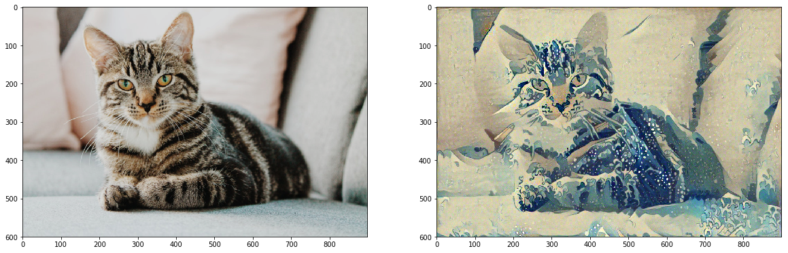
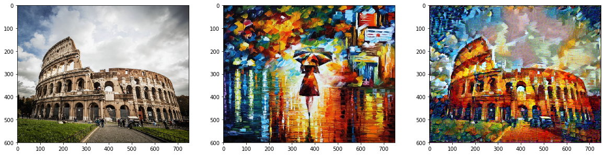

# Neural-Style-Transfer
An image consists of 2 Parts, Content and Style. Here it is an style transfer method to transfer the style of an image to annother.
The implementation is done according to the paper: https://www.cv-foundation.org/openaccess/content_cvpr_2016/papers/Gatys_Image_Style_Transfer_CVPR_2016_paper.pdf)

Here we use a pretrained VGG-19 model with all layers frozen to get the content and style layer.
Then we are required to find the relation between out style layers to extract the style from the image.
Then the style is required to be merged with content of another to create our target image.

We calculate content and style losses an then try to merge the style and content of different images while also minimising the total loss using ADAM optimizer.

Total loss is calculated as the sum of content loss and the style loss.

The final results are not the best out there, but it is a good start and can be further impproved by tuning thee hyperparameters like layer weights and using some further techniques.

Here's a look at the initial and Final output(Here I have merged the Cat with the style from The Great Wave of Kanagawa)

Here's another example what the style transfer method can achieve. Here I have taken Colloseum(Image 1) as content image and Rain Princess(Image 2) as the style image. The final output can be seen in Image 3. It surely adds a new touch to the colloseum.

